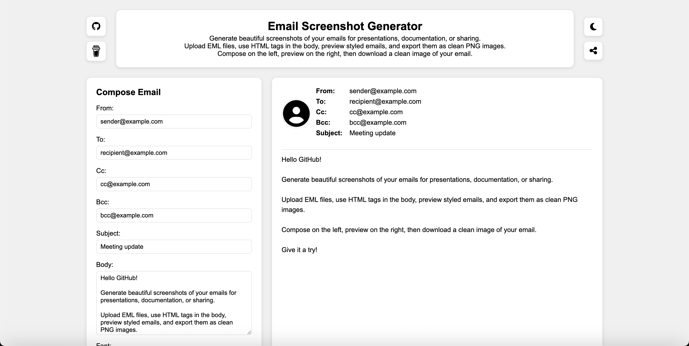

<!-- Begin README -->

<div align="center">
    <a href="https://scottgriv.github.io/Binary-Converter" target="_blank">
        
    </a>
</div>
<br>
<p align="center">
    <a href="https://vuejs.org/"></a>
    <a href="https://www.javascript.com/"></a>
    <a href="https://nodejs.org/en/"></a>
    <br>
    <a href="https://github.com/scottgriv"></a>
    <a href="mailto:scott.grivner@gmail.com"></a>
    <a href="https://www.buymeacoffee.com/scottgriv"></a>
    <br>
    <a href="https://github.com/scottgriv/Email-Screenshot-Generator/actions/workflows/gh-pages.yml" target="_blank"></a>
    <a href="https://prgportfolio.com" target="_blank"></a>
</p>

---------------

<h1 align="center">Email Screenshot Generator</h1>

Generate beautiful screenshots of your emails for presentations, documentation, or sharing. Upload EML files, use HTML tags in the body, preview styled emails, and export them as clean PNG images.
- Built using **Vue.js**.
- View a demo of the project on GitHub Pages **[Here](https://scottgriv.github.io/Email-Screenshot-Generator)**.

<div align="center">
    <a href="https://scottgriv.github.io/Email-Screenshot-Generator" target="_blank">
        
    </a>
    <br>
    <i>Application Preview</i>
</div>

---------------

## Table of Contents

- [How This Works](#how-this-works)
- [Getting Started](#getting-started)
- [Resources](#resources)
- [License](#license)
- [Credits](#credits)

## How This Works

1. Enter your email information in the left panel (top on mobile) and view the preview of it in the right panel (bottom on mobile).
2. Click the "Generate Email Image" button to create a screenshot of your email (`.png` format).
3. Click "Reset Fields" to reset all fields and image to start again.

**Optionally:**
1. Upload an EML file to pre-fill the email information (Note: images will not be exported due to CORS policy).
2. Click the "Upload Image" button to upload an image to use as your sender's profile picture.
3. Change your preferred font and font size using the dropdowns on the bottom of the left panel (top on mobile).
4. Toggle between light and dark mode using the toggle switch in the top right corner of the page.
5. Share the web app with others using the "Share" button in the top right corner of the page.
6. The Body support HTML tags, so you can add links, images, and other HTML elements to your email body.
7. Cc and Bcc can be left blank if not needed, they will not be included in the email preview as labels if left blank.

## Getting Started

1. Project setup
```
npm install
```

2. Compiles and hot-reloads for development
```
npm run serve
```

3. Compiles and minifies for production
```
npm run build
```

4. Lints and fixes files
```
npm run lint
```

## Resources

- [Vue.js](https://vuejs.org/) - A progressive, incrementally-adoptable JavaScript framework for building UI on the web.
- [Vite Configuration Reference](https://vite.dev/config/) - Vite is a fast build tool that focuses on speed and performance, providing a modern development experience for web applications.
- [Vue CLI](https://cli.vuejs.org/) - Vue CLI is a standard tooling for Vue.js development.
- [JavaScript](https://www.javascript.com/) - A lightweight, interpreted, or just-in-time compiled programming language with first-class functions.
- [Node.js](https://nodejs.org/en/) - A JavaScript runtime built on Chrome's V8 JavaScript engine.

## License

This project is released under the terms of the **MIT License**, which permits use, modification, and distribution of the code, subject to the conditions outlined in the license.
- The [MIT License](https://choosealicense.com/licenses/mit/) provides certain freedoms while preserving rights of attribution to the original creators.
- For more details, see the [LICENSE](LICENSE) file in this repository. in this repository.

## Credits

**Author:** [Scott Grivner](https://github.com/scottgriv) <br>
**Email:** [scott.grivner@gmail.com](mailto:scott.grivner@gmail.com) <br>
**Website:** [linktr.ee/scottgriv](https://www.linktr.ee/scottgriv) <br>
**Reference:** [Main Branch](https://github.com/scottgriv/Email-Screenshot-Generator) <br>

---------------

<div align="center">
    <a href="https://linktr.ee/scottgriv" target="_blank">
        
    </a>
</div>

<!-- End README -->
